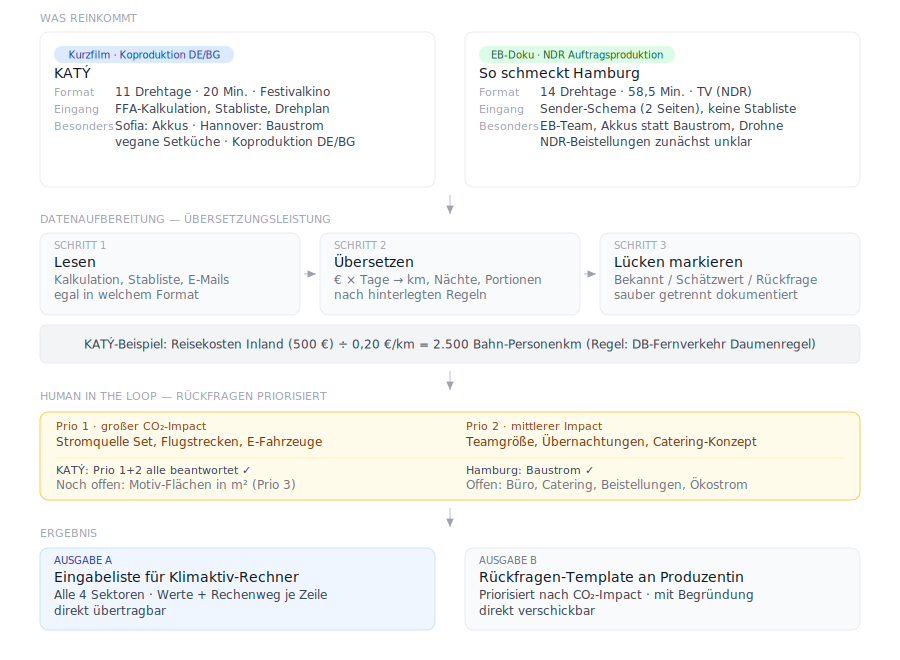

# Klimaktiv-Workflow Skill: CO2-Soll-Bilanz

KI-gestützter Workflow für die Erstellung von CO₂-Soll-Bilanzen im Klimaktiv-Rechner
(Green Motion / Ökologische Standards).

**Version 0.1.0** · Entwickelt von Robert Knörk, Green Consultant, Bremen.

---

## Was dieser Skill tut

Übersetzt Produktionsunterlagen (Kalkulation, Stabliste, Drehplan, Herstellungsplan, E-Mails)
in strukturierte Eingabelisten für den Klimaktiv-Rechner — inklusive priorisierter Rückfragen
an die Produzentin für alles was noch fehlt.

Ausgabe:
- Stammdaten für den Klimaktiv-Rechner
- Eingabeliste pro Handlungsfeld (Energie / Reise+Transport / Catering / Materialeinsatz)
- Rückfragen-Template (Prio 1/2/3)

Grundlage: Vereinfachte SOLL-Erfassung gemäß Kriterium I.3 der Ökologischen Standards.

---

## So funktioniert der Prozess

**1. Lesen** — Der Skill nimmt entgegen was da ist: FFA-Kalkulation, SESAM-Kalkulation,
Sender-Schema, Stabliste, Drehplan, Motivliste, E-Mails, WhatsApp-Nachrichten. Format
und Vollständigkeit sind egal — der Skill arbeitet mit dem was vorliegt.

**2. Übersetzen** — Kalkulationspositionen in Euro und Tagen werden nach hinterlegten Regeln
in die Eingabefelder des Klimaktiv-Rechners übersetzt: km, Personenkilometer, Nächte,
Portionen, m², Nutzungstage. Jeder Rechenweg wird in der Notiz dokumentiert.

**3. Lücken markieren** — Was direkt ableitbar ist, geht in die Eingabeliste. Was geschätzt
werden muss, bekommt eine Standardannahme mit Notiz. Was fehlt, wird zur priorisierten
Rückfrage (Prio 1 = großer CO₂-Impact, Prio 3 = Schätzwert reicht).

**4. Human in the Loop** — Der Green Consultant arbeitet iterativ mit dem Skill: Der Skill
legt Zwischenergebnisse vor, der GC prüft, korrigiert und gibt frei. Rückfragen an die
Produzentin (C1, C2, C3...) werden nach Rückmeldung eingearbeitet — der Skill aktualisiert
die Eingabeliste, der GC entscheidet ob das Ergebnis trägt.

**5. Eingabeliste übergeben** — Das Ergebnis ist eine tabellarische Liste die direkt in den
Klimaktiv-Rechner übertragen werden kann: Handlungsfeld, Quelle, Bezeichnung, Wert, Einheit,
Notiz.

---

## Installation

### Voraussetzungen

- Claude-Account (kostenlos möglich, aber siehe Hinweis unten)
- Claude Desktop App oder claude.ai im Browser

> **Hinweis zur kostenlosen Version:** Der Workflow funktioniert grundsätzlich auch ohne bezahlten Account. Sobald jedoch mehrere Dateien hochgeladen werden (Kalkulation, Stabliste, Drehplan, Angebote), ist die kostenlose Nachrichtengrenze schnell erreicht — danach geht es erst nach einigen Stunden weiter. Für den produktiven Einsatz empfiehlt sich Claude Pro (18 €/Monat).

### Einmalige Einrichtung

In Claude Desktop oder claude.ai:
**Einstellungen → Fähigkeiten → "Cloud-Code-Ausführung und Dateierstellung"** aktivieren.
Ohne diesen Toggle funktionieren Skills nicht.

### Skill installieren

1. Auf GitHub oben rechts **Code → Download ZIP** klicken
2. In Claude (Desktop oder Web): **Anpassen → Skills → + → Skill erstellen → Skill hochladen**
3. Die heruntergeladene ZIP-Datei direkt hochladen (nicht entpacken)
4. Skill erscheint unter "Persönliche Skills"
5. Neuen Chat öffnen — Skill ist verfügbar

**Updates:** Neue ZIP von GitHub laden, alten Skill löschen, neu hochladen.

### Erster Test

Im Chat eingeben: *"Ich habe eine Kalkulation für einen Kurzfilm — erstelle eine Soll-Bilanz."*
Der Skill sollte mit Schritt 0 (Arbeitsweise festlegen) starten.

---

## Struktur
| Datei | Inhalt |
|---|---|
| `SKILL.md` | Workflow, Trigger, Loop-Logik |
| `references/mapping_regeln_basis.md` | Übersetzungsregeln, Annahmen, Rückfragen-Logik |
| `references/mapping_regeln_spielfilm.md` | Ergänzungen für Spielfilm / Kurzfilm |
| `references/mapping_regeln_doku.md` | Ergänzungen für Dokumentarfilm / Reportage |
| `references/klimaktiv_rechner_struktur_vereinfacht.json` | Vereinfachte Rechner-Struktur (SOLL) |
| `references/klimaktiv_rechner_struktur.json` | Vollständige Rechner-Struktur (Sonderfälle) |
| `references/onboarding_fragebogen.md` | Fragebogen für offene Punkte nach Eingang der Unterlagen |
| `references/oekologische_standards_destilliert.md` | 25 Muss-Vorgaben, Stand September 2025 |
| `references/leitlinien_bilanzierung_destilliert.md` | Systemgrenzen, Wesentlichkeit, Berechnungsregeln |

---

## Skill verbessern (Human in the Loop)

Korrekturen fließen über den `→ Skill:` Trigger direkt ins Repo:

1. Im Chat `→ Skill: [Regelkorrektur]` schreiben
2. Claude formuliert den Diff
3. Claude Code schreibt die Änderung ins Repo
4. Nächste Session: Skill ist aktualisiert

**Wichtig:** Keine Euro-Werte, Emissionsfaktoren oder Jahreszahlen in den Mapping-Dateien.
Der Skill speichert Methoden — keine Daten. Daten liefert der Klimaktiv-Rechner.

---

## Produktionsformate

Aktuell unterstützt:
- Spielfilm / Kurzfilm
- Dokumentarfilm / Reportage

Geplant:
- Serie
- Werbefilm / Imagefilm

---

## Wissensquellen

- **Klimaktiv-Rechner:** [go.greenshooting.de](https://go.greenshooting.de)
- **Ökologische Standards:** September 2025, KlimAktiv gGmbH
- **Leitlinien CO₂-Bilanzierung:** Arbeitskreis Green Shooting, BVGCD
- **Brain BVGCD:** Gemeinsames Wissenssystem des Bundesverbands Green Consultants Deutschland (lesend)

---

## FAQ

**Werden hochgeladene Produktionsdaten (Kalkulation, Stabliste) für das Training genutzt?**

Das hängt von den Privacy-Einstellungen des Claude-Accounts ab, mit dem gearbeitet wird.
Seit Oktober 2025 gibt es für Free-, Pro- und Max-Accounts eine Opt-in-Möglichkeit.
Wer beim Update im Herbst 2025 einfach „Akzeptieren" geklickt hat, hat den Toggle
möglicherweise unbewusst aktiviert.

Nachschauen und ggf. deaktivieren:
claude.ai → Einstellungen → Datenschutz → „Claude für alle verbessern" → Toggle aus

Wer auf Nummer sicher gehen will: Incognito-Modus nutzen (kein Login, keine Speicherung,
kein Training — unabhängig von den Einstellungen).

Für API-Nutzung und Claude for Work gelten strengere Regeln: dort werden hochgeladene
Daten grundsätzlich nicht für Training verwendet.

**Darf ich Stablisten und Kalkulationen hochladen?**

Stablisten enthalten personenbezogene Daten (Namen, teils Adressen). Empfehlung:
Adressen vor dem Upload entfernen. Namen sind in der Regel unkritisch — sie dienen
nur der Teamgrößen-Schätzung, nicht als Inhalt der Bilanz.

---

## Mitmachen

Interesse an KI-Tooling für die CO₂-Bilanzierung?
Voraussetzung: Claude-Account und Praxiserfahrung als Green Consultant.

Kontakt: [robert@knoerk.com](mailto:robert@knoerk.com)
